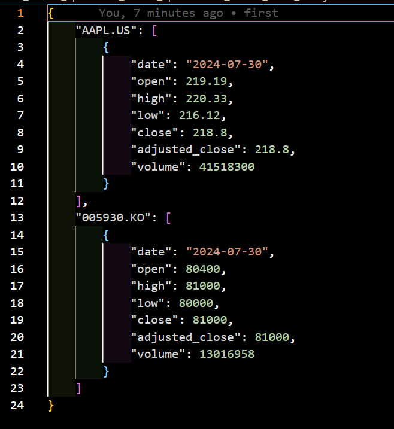

# eodhd api 로 주가 데이터 가져오기

[EODHD 사이트](https://eodhd.com/cp/api)

# start  
`python`, `poetry` 필수 설치

### 1. 깃 클론

```bash
git clone https://github.com/bamjun/starting_eodhd_api.git
```

### 2. `start_eodhd_api` 폴더로 이동

```bash
cd starting_eodhd_api
```

### 3. 포이트리 update

```bash
poetry update
```

### 4. 가상환경 진입

```bash
poetry shell
```

### 5. 파일실행

- eodhd 파이썬 라이브러리 이용한 데이터 추출

```bash
cd start_eodhd_api && python lib_eodhd.py
```

- reqeusts를 이용한 데이터 추출

```bash
cd start_eodhd_api && python requests_eodhd_api.py
```


